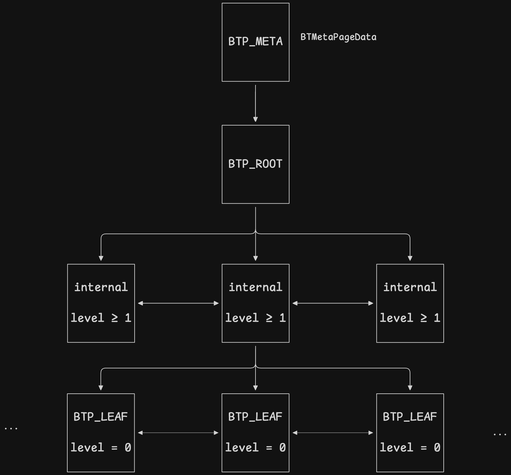

# INDEX page

```sql
drop table if exists tb;
create table tb (a int, b bigint);
insert into tb select n, n from generate_series(1, 100000) as n;
create index idx on tb(a);
ANALYZE tb;

explain select * from tb where a = 5432;
                          QUERY PLAN
---------------------------------------------------------------
 Index Scan using idx on tb  (cost=0.29..8.31 rows=1 width=12)
   Index Cond: (a = 5432)
```

## index file

```sql
select pg_relation_filepath('idx');
 pg_relation_filepath
----------------------
 base/5/99591
```

## index structure



```sql
SELECT relpages FROM pg_class WHERE relname = 'idx';
 relpages
----------
      276

SELECT magic, version, root, level FROM bt_metap('idx');
 magic  | version | root | level
--------+---------+------+-------
 340322 |       4 |    3 |     1
```

## index page

```
+-----------------------------------------------------------------------+
|  PageHeaderData (24 bytes)                                            |
+-----------------------------------------------------------------------+
|  Line Pointer 1 (4 bytes)  ==> ItemID                                 |
|  Line Pointer 2 (4 bytes)                                             |
|  Line Pointer 3 (4 bytes)                                             |
|  ...                                                                  |
|  ---------------------> (Grows Downward)                              |
|                                                                       |
|                          <--- Free Space --->                         |
|                                                                       |
|  <--------------------- (Grows Upward)                                |
|  ...                                                                  |
|  Index Tuple 3 (Data)      ==> IndexTupleData                         |
|  Index Tuple 2 (Data)                                                 |
|  Index Tuple 1 (Data)                                                 |
+-----------------------------------------------------------------------+
|  Special Space (B-Tree opaque data like sibling pointers, 16 bytes)   |
+-----------------------------------------------------------------------+
```

## index tuple

```sql
select * from bt_page_items('idx', 1) limit 5;
 itemoffset | ctid  | itemlen | nulls | vars |          data           | dead | htid  | tids
------------+-------+---------+-------+------+-------------------------+------+-------+------
          1 | (1,1) |      16 | f     | f    | 6f 01 00 00 00 00 00 00 |      |       |
          2 | (0,1) |      16 | f     | f    | 01 00 00 00 00 00 00 00 | f    | (0,1) |
          3 | (0,2) |      16 | f     | f    | 02 00 00 00 00 00 00 00 | f    | (0,2) |
          4 | (0,3) |      16 | f     | f    | 03 00 00 00 00 00 00 00 | f    | (0,3) |
          5 | (0,4) |      16 | f     | f    | 04 00 00 00 00 00 00 00 | f    | (0,4) |
```
