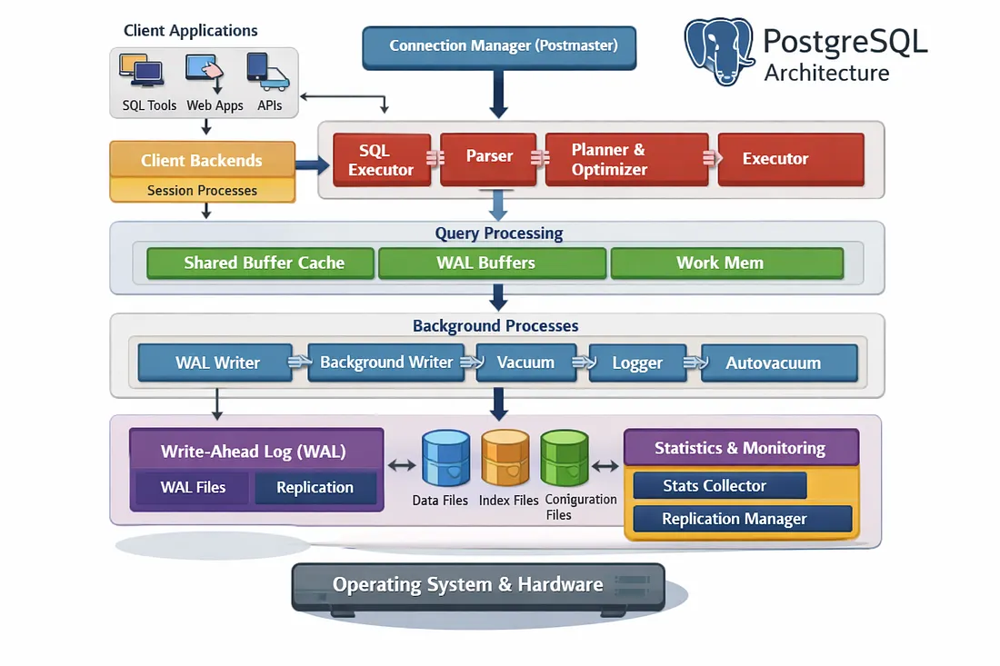
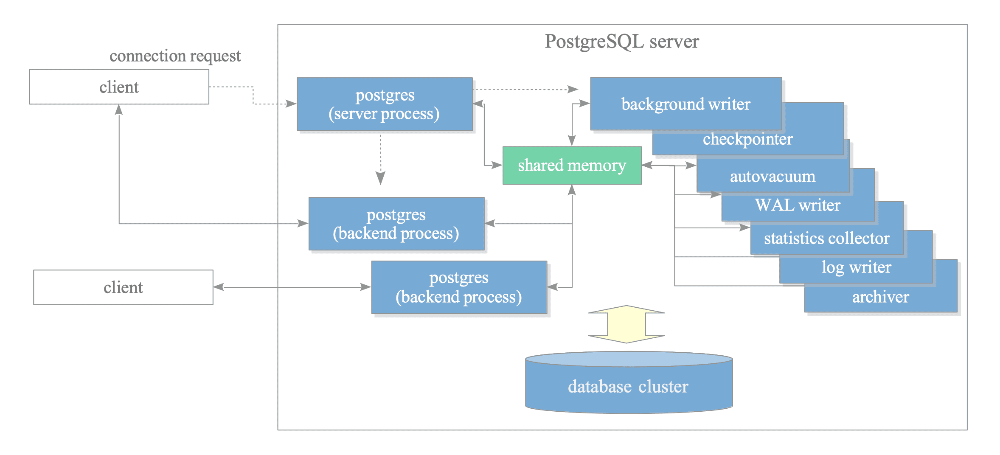

# Architecture

## Process Architecture

> https://medium.com/@reetesh043/ee5b24b52a30

> https://www.interdb.jp/pg/pgsql02/01.html

## PG 鍐呮牳鍏ㄦ櫙

- **鎺у埗**锛氬垎鏋? 浼樺寲, 鎵ц
- **鏁版嵁**锛氳闂柟娉?Heap/Index, **Buffer Cache**, 鐗╃悊纾佺洏)
- **浜嬪姟**锛歀ock Manager, WAL/CLOG, MVCC (Visible check)
- **鍏冩暟鎹?*锛歋yscache(绯荤粺琛ㄧ紦瀛?, Relcache(琛ㄥ畾涔夌紦瀛?
- **杩愯**锛歁emoryContext, 淇″彿閲?鍏变韩鍐呭瓨, 杈呭姪杩涚▼
